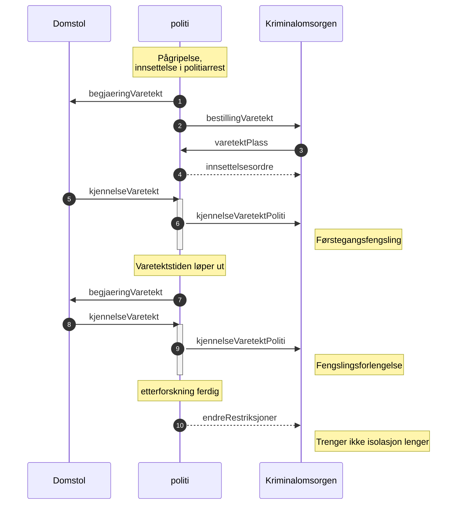

# Kjennelse på varetekt til Kriminalomsorgen (kjennelseVaretektPoliti)
Når politiet mottar kjennelse så blir kjennelsen strukturert og med kjennelse/rettsbok PDF rutet videre til Kriminalomsorgen.
Det skal legges ved data om straffesakene, se nedenfor.

Denne meldingen skal brukes på førstegangsfengslinger og fengslingsforlengelser og den erstatter oppdaterVaretekt (nå slettet) sammen med meldingen [endreRestriksjoner](../endreRestriksjoner/readme.md)  
Når politiet mottar en kjennelse på varetekt så blir denne meldingen sendt automatisk til Kriminalomsorgen og den vil inneholde kjennelsen strukturert og på PDF format fra domstolen samt data fra straffesaken hos politiet.

[Endringslogg](changelog.md) 
## Headere forsendelse justisHub
SchmaName=KJENNELSE_VARETEKT_POLITI  
SchemaVersion=1.0  
[RFC message name header](../../../rfc/MessageName-header.md)

Versjon 1.0 er første versjon som skal til pilot høsten 2023 og er en del av oppdaterVaretekt som skal erstattes av kjennelseVaretektPoliti og 
## Status - ikke godkjent
Begge parter må være enige om innholdet.  
Ikke fått gått gjennom alle detaljer fra [PR 53 innsettelsesordre](https://github.com/domstolene/ESAS/pull/53) som må svares ut fordi det er en del generelle kommentarer der.
## Data
### avsender og domstol
Det er automatisk videresending av kjennelsen fra domstolen fra politiet, avsender vil være eierdistriktet for straffesaken. Informasjon om domstol, dommmer og saksbehandler kommer sammen med kjennelsen.
### Forlengelse
Hvis kjennelsen er et svar på en begjæring om varetekt med forlengelse.  
**OBS** til å begynne med så er flagget forelengelse i begjæringen satt av brukerne hvis førstegangsfengslingen er gjort på gammelmåten via BL.
### Siktede
Siktede fra domstolen kan være en en annen person en den som finnes på straffesaken, dvs. vi finner ikke match mellom data fra domstolen og det vi har som straffesaksdata.
* *personVaretektInfo->personVaretekt* er personen fra straffesak hvis vi finner match mellom domstolen sin person og en siktet person på straffesaken (fødselsnummer, SSP nummer, D-nummer, etternavn, fornavn), det bør alltid være match.
* Siktede informasjon fra domstolen finnes i kjennelsen   
*kjennelseVaretekt->personVaretektDomstol*.
* Siktedes informasjon fra straffesaken vil finnes på: *personVaretektInfo->straffesaksInfo->siktet*
### Straffesaksdata
I første omgang så kommer informasjon kun fra hovedsaken og det kommer ikke med lovbud. Når siktelsen kommer (sammen med tilståelsessaker) så vil vi kunne sende med informasjon på alle straffesaker som siktede er involvert i.
### Data om helse, risiko og tilstand
[Kommer i bestillingVaretekt meldingen](../bestillvaretektsplass/readme.md) *oppdatert beskrivelse på data*
### Det legges ikke ved PDF dokumenter fra straffesaken
Dvs. siktelses PDF blir ikke med, se avklaring nedenfor. Kjennelsen fra domstolen på PDF format blir lagt ved oversendelsen.
## Flyt

* Kvitteringer skal sendes på alle meldinger og er ikke vist i diagrammet.
* varetektsplass er tilbud på plass i et gitt fengsel, se [bestillingVaretekt](../bestillvaretektsplass/readme.md)
* Innsettelsesordren er vist som et eksempel og vil bli brukt hvis kjennelsen ikke er klar til når personen skal flyttes til Kriminalomsorgen.
* [endreRestriksjoner](../endreRestriksjoner/readme.md) så påtale kan lette på restriksjoner. Ikke planlagt når denne skal implementeres.
## Avklaringer
I arbeidet med fengslinger og informasjon mellom politi og Kriminalomsorgen er det gjort noen antagelser i den nye meldingen for kjennelse fra domstolene.
### Straffesaksinformasn (Siktelse) og data til Kriminalomsorgen
Kjennelsen fra domstolen inneholder ikke detaljer om siktelsen til den personen som skal varetektsfengsles og den strukturerte kjennelsen er heller ikke klar fra politiet.
1. Siktelsesdokumentet (PDF) blir ikke med da det inneholder informasjon om andre og detaljert beskrivelse av hva som skjedde.
### Siktelsesinformasjon til senere
Senere så vil vi ta med siktelsesinformasjon inkludert lovbud på alle straffesaker siktede er siktet for.
1. Grunnlagstekst er en beskrivelse av selve hendelsen, trenger Kriminalomsorgen den?
### Kjennelse
Det kommer småjusteringer på kjennelsen ennå.