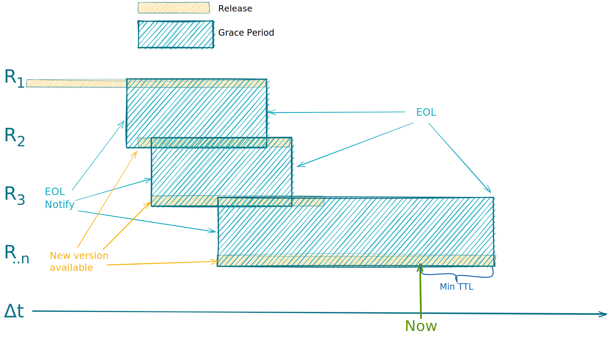

## Rullende oppgraderingsvindu på JustisHub

**To be Reviewed By**: Martin Myran, Jostein Klakegg

**Authors**: Carl Fredrik Bøkestad

**Status**: Discussion

### Problemstilling

I forbindelse med endring av meldingsformater over JustisHub trenger vi rutine/system som gir forutsigbarhet for hvordan vi endrer/oppgraderer kontrakter.  Og som beskriver hvordan disse kan gjøres uten nedetid, i vanlige oppgraderings situasjoner, og når det implementerers _breaking changes_.

Det er ulike virksomheter koblet til JustisHub det er derfor viktig at oppgraderinger kan gjøres autonomt og forutsigbart i størst mulig grad. Dette forutsetter at alle parter er inneforstått med regimet og de forpliktelser som følger av den beskrevne løsingen.

### Løsningsforslag

Forslaget går ut på at ved en oppgradering av kontrakt er mottaker/konsument ansvarlig for å håndtere mottak av alle versjoner av meldingen i en _grace periode_.
*Grace perioden* for et gitt miljø, blir man enige om på forhånd - f.eks. 1 måned (eller til at avsender har informert om at de ikke lenger kommer til å produsere tidligere versjoner).

Header på meldingene må inneholde et versjonsnummer som tilsvarer versjonen på kontrakten meldingen skal reflektere slik at mottaker kan behandle meldingen korrekt (riktig versjon). Avsender/produsent av melding kan selv velge (innenfor grace-perioden) når man oppgraderer fra en versjon til en annen.

Ved introduksjon  av ny versjon er det da mottaker sitt ansvar å kommunisere *End of life" på forrige versjon til avsender.

**Eksempel**:

* Domstolen sender meldinger til politiet på _versjon 1_.
* Ved en oppgradering av kontrakt starter politiet å motta meldinger på _versjon 1 og 2_ på samme kø fra 01.10.2022.
* Politiet må samtidig informere domstolen om at versjon 1 har EOL 1.11.2022.
* Domstolen kan da fortsette å sende meldingene markert med _versjon 1_ helt til de får oppgradert sine systemer og går over til å sende meldinger merket med _versjon 2_
* Politiet forplikter seg til å motta meldinger på versjon 1 og 2 minst frem til 1.11.2022 (eller til at domstolen har informert om at de er på _versjon 2_)
  * Dersom domstolen forstetter å sende meldinger på version 1 etter EOL har politiet mulighet til å forkaste disse

Det vi da oppnår vi at begge virksomhetene kan implementere oppgradering av kontrakten i takt med sin utrullings-sekvens.
I teorien kan mottaker være nødt til å supportere mange versjoner samtidig dersom der det er flere endringer over kort tid.

Med denne løsningen går man fra å være en teknisk utfordring til en mer merkantil beslutning.

*Grace Period* - Periode der mottaker må støtte flere versjoner av den samme meldingen samtidig

*EOL Noitfy* - Når mottaker informerer avsender om at en gitt versjon ikke behandles lengre

*EOL* - Når en gitt versjon ikke behandles lengre

### Alternative løsninger:
* Simultane oppgraderinger for alle brukere av JustisHub
* Avsender oppgraderer først. Avsender sender da meldinger på i alle versjoner i grace-perioden, slik at mottaker bare behandler den versjonen de er på. Mottaker kan da f.eks. kaste versjon 1 og behandle versjon 2.
  * Avsender slutter da å sende versjon 1 når grace-perioden er over.
* Andre forslag??

### FAQ
_<Svar til vanlige spørsmål stilt etter RFC til dette forslaget>_
